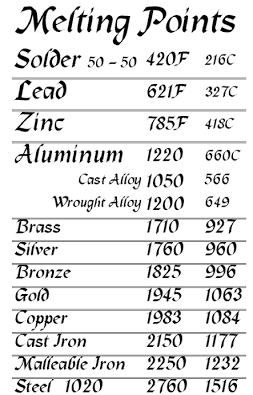

# Comprehensive Metallurgy & Thermal Processing Guide

This manual serves as the authoritative reference for toolroom machinists, blacksmiths, foundrymen, and metallurgical engineers. It covers raw material stock calculations, thermal color recognition, phase transition thermodynamics, and precise heating, melting, and casting temperatures across industrial metal alloy systems.

---

## 1. Stock Volume and Weight Formulas
The most common calculation in blacksmithing and machining is determining how much starting raw material is required. Because metal volume is conserved during forging and plastic deformation (aside from minor scaling losses), the volume of your starting stock must equal the volume of your finished piece.

### For Rectangular / Flat Stock:
$$V = L \times W \times H$$
*(Volume = Length × Width × Thickness)*

### For Round Stock / Cylinders:
$$V = \pi \times r^2 \times h = \frac{\pi \times d^2 \times h}{4}$$
*(Volume = $\pi$ × radius squared × length)*

### To Calculate Weight:
Once the volume is established, multiply by the material density (specific gravity):
$$m = \rho \times V$$
*(Mass = Density × Volume)*

* **Standard Steel Density:** ~0.284 lbs per cubic inch ($7.85\text{ g/cm}^3$)
* **Aluminum Density:** ~0.098 lbs per cubic inch ($2.70\text{ g/cm}^3$)
* **Brass Density:** ~0.308 lbs per cubic inch ($8.53\text{ g/cm}^3$)

---

## 2. Heat and Color Cheat Sheet
When heating steel in a forge or furnace, the emitted incandescent color indicates its temperature and determines the appropriate thermal processing stage. Perceived color can vary slightly depending on shop ambient lighting; dim shop lighting is recommended for accurate visual temperature judging.

| Process Stage | Temperature (°F) | Temperature (°C) | Incandescent Steel Color | Shop Action & Metallurgical Note |
| :--- | :--- | :--- | :--- | :--- |
| **Forge Welding** | 2,300° – 2,500°F | 1,260° – 1,370°C | **Sparkling White to Cream** | Steel is near its melting point; surface fluxes melt instantly. |
| **Heavy Forging** | 1,800° – 2,200°F | 980° – 1,200°C | **Bright Yellow to Orange-Yellow** | Maximum plasticity; ideal for drawing down and heavy deformation. |
| **Light Forging** | 1,500° – 1,750°F | 815° – 955°C | **Bright Red to Orange-Red** | Refining shapes, planishing, and finishing details. |
| **Normalizing / Annealing**| 1,450° – 1,600°F | 790° – 870°C | **Cherry Red / Non-Magnetic (Ac3)** | Austenite phase transition occurs; grain structure recrystallizes. |
| **STOP FORGING!** | Below 1,350°F | Below 730°C | **Dull Red to Dark Brown** | **CRITICAL:** Forging below Ac1 risks cold work stress and severe cracking! |

### Tempering Oxide Colors (Surface Oxidation on Hardened Steel):
When tempering quenched steel, temperature is judged by the thin interference oxide film forming on a polished surface:
* **400°F (204°C) – Faint Yellow / Pale Straw:** Maximum hardness; used for lathe scrapers and engraving tools.
* **440°F (226°C) – Light Straw:** High edge retention; used for knives, plane irons, and wood chisels.
* **500°F (260°C) – Brown / Purple:** Balanced toughness and hardness; used for axes, cold chisels, and center punches.
* **575°F (301°C) – Deep Blue / Cornflower Blue:** Maximum spring elasticity; used for springs, screwdrivers, and saws.

---

## 3. Comprehensive Metal Heating, Melting, & Casting Temperatures Guide

Understanding the distinct thermal boundaries of metals is critical for forging, heat treating, alloy alloying, and foundry casting. A metal does not behave identically across its elevated temperature spectrum; engineers must distinguish between **Heating (Working) Points**, **Melting Phase Transitions (Solidus/Liquidus)**, and **Casting (Pouring) Temperatures**.

### 🔬 Metallurgical Definitions:
1. **Heating / Hot Working Range:** The temperature window where a metal recrystallizes faster than it work-hardens. In this zone, the metal is ductile and malleable, allowing forging, bending, and rolling without fracturing.
2. **Solidus Temperature ($T_{\text{solidus}}$):** The precise temperature at which an alloy begins to melt. Below the solidus, the metal is completely solid.
3. **Liquidus Temperature ($T_{\text{liquidus}}$):** The precise temperature at which an alloy becomes 100% molten liquid. Between the solidus and liquidus lies the "mushy zone" (semi-solid slurry). Pure metals and eutectic alloys have identical solidus and liquidus points.
4. **Casting / Pouring Superheat ($\Delta T_{\text{sh}}$):** You **cannot** cast metal right at its liquidus temperature! Molten metal cools rapidly upon contact with the ladle, runners, and mold walls. If poured at the liquidus, it will prematurely freeze (misruns and cold shuts) before filling intricate mold cavities. Foundrymen apply a **Superheat**—typically **100°F to 300°F (50°C to 165°C) above the liquidus**—to achieve the required fluidity and lower viscosity for successful casting.

---

### 📊 Master Table 1: Ferrous Metals & Carbon Steels
*Ferrous alloys require high thermal energy. As carbon content increases, the melting point and required casting superheat decrease, but the steel becomes more susceptible to thermal shock.*

| Metal / Alloy Name | Heating / Forging Range (°F / °C) | Solidus (Melting Start) | Liquidus (100% Molten) | Recommended Casting / Pouring Temp (°F / °C) | Metallurgical Characteristics & Casting Notes |
| :--- | :--- | :--- | :--- | :--- | :--- |
| **Pure Iron (Fe)** | 1,800° – 2,300°F<br>(980° – 1,260°C) | 2,768°F<br>(1,520°C) | 2,768°F<br>(1,520°C) | 2,900° – 3,050°F<br>(1,593° – 1,677°C) | Highly ductile; rarely cast due to high melting point and oxidation; used for magnetic cores. |
| **Wrought Iron** | 1,900° – 2,400°F<br>(1,038° – 1,315°C) | 2,700°F<br>(1,482°C) | 2,750°F<br>(1,510°C) | 2,880° – 3,000°F<br>(1,582° – 1,649°C) | Contains fibrous iron silicate slag; must be forged very hot (nearly white heat) to prevent slag delamination. |
| **1018 Mild Steel** | 1,600° – 2,200°F<br>(870° – 1,204°C) | 2,640°F<br>(1,449°C) | 2,780°F<br>(1,527°C) | 2,900° – 3,020°F<br>(1,593° – 1,660°C) | Most common structural steel; excellent weldability and ductility; cast in investment and sand molds. |
| **1045 Medium Carbon**| 1,550° – 2,100°F<br>(843° – 1,149°C) | 2,570°F<br>(1,410°C) | 2,720°F<br>(1,493°C) | 2,850° – 2,970°F<br>(1,565° – 1,632°C) | Tough machinery steel (axles, gears); heat-treatable; requires controlled cooling after casting. |
| **1095 High Carbon** | 1,450° – 1,950°F<br>(788° – 1,065°C) | 2,400°F<br>(1,315°C) | 2,650°F<br>(1,454°C) | 2,780° – 2,900°F<br>(1,527° – 1,593°C) | Tool & spring steel (knives, files); narrow forging window; burns and decarburizes easily if overheated. |
| **4130 / 4140 Chromoly**| 1,600° – 2,150°F<br>(870° – 1,177°C) | 2,600°F<br>(1,427°C) | 2,750°F<br>(1,510°C) | 2,880° – 3,000°F<br>(1,582° – 1,649°C) | Chrome-moly aircraft and roll cage alloy; deep hardening; preheating mold is critical for thin castings. |
| **304 / 316 Stainless** | 1,700° – 2,250°F<br>(927° – 1,232°C) | 2,550°F<br>(1,399°C) | 2,650°F<br>(1,454°C) | 2,800° – 2,950°F<br>(1,538° – 1,621°C) | Austenitic non-magnetic stainless; sluggish liquid fluidity requires high superheat and rapid mold filling. |
| **Gray Cast Iron** | *Do Not Forge (Brittle)* | 2,060°F<br>(1,127°C) | 2,200°F<br>(1,204°C) | 2,400° – 2,600°F<br>(1,315° – 1,427°C) | Contains graphite flakes; outstanding vibration damping and machinability; excellent casting fluidity and low shrinkage (~1%). |
| **Ductile (Nodular) Iron**| *Do Not Forge* | 2,050°F<br>(1,121°C) | 2,150°F<br>(1,177°C) | 2,450° – 2,650°F<br>(1,343° – 1,454°C) | Inoculated with magnesium to form spherical graphite nodules; high tensile strength and ductility in cast components. |

---

### 📊 Master Table 2: Aluminum & Light Alloys
*Light metals oxidize instantly in air, forming a tough surface oxide layer ($Al_2O_3$) that melts at over 3,700°F (2,037°C) while the aluminum underneath melts at ~1,200°F. Always flux and skim before pouring!*

| Metal / Alloy Name | Heating / Forging Range (°F / °C) | Solidus (Melting Start) | Liquidus (100% Molten) | Recommended Casting / Pouring Temp (°F / °C) | Metallurgical Characteristics & Casting Notes |
| :--- | :--- | :--- | :--- | :--- | :--- |
| **Pure Aluminum (99.9%)**| 550° – 950°F<br>(288° – 510°C) | 1,220°F<br>(660°C) | 1,220°F<br>(660°C) | 1,320° – 1,420°F<br>(715° – 771°C) | Soft and ductile; high shrinkage (~6.6%); prone to gas porosity if molten metal absorbs hydrogen from atmospheric moisture. |
| **5052 Aluminum Sheet**| 500° – 900°F<br>(260° – 482°C) | 1,100°F<br>(593°C) | 1,200°F<br>(649°C) | 1,300° – 1,420°F<br>(704° – 771°C) | Alloyed with magnesium; excellent corrosion resistance; widely used in marine sheet metal fabrication and pressure vessels. |
| **6061-T6 Structural** | 500° – 900°F<br>(260° – 482°C) | 1,080°F<br>(582°C) | 1,205°F<br>(652°C) | 1,320° – 1,450°F<br>(715° – 788°C) | Most versatile extruded and machined aluminum; solution heat treated and artificially aged; hot short (brittle when near melting). |
| **7075 Aircraft Alloy** | 700° – 850°F<br>(371° – 454°C) | 890°F<br>(477°C) | 1,175°F<br>(635°C) | *Not Recommended for Casting (Use 6061/A356)* | Zinc-alloyed aerospace aluminum; ultra-high strength; very wide mushy zone makes casting prone to severe hot tearing and segregation. |
| **A356 / 356 Casting Alloy**| *Designed for Casting* | 1,035°F<br>(557°C) | 1,135°F<br>(613°C) | 1,250° – 1,380°F<br>(677° – 749°C) | The premier foundry casting aluminum; alloyed with 7% Silicon for incredible fluidity, mold filling, and pressure tightness. |

---

### 📊 Master Table 3: Copper, Brass & Bronze Alloys
*Copper alloys are heavily utilized for bearings, bushings, marine hardware, and electrical conductors. Zinc in brass boils and vaporizes at 1,665°F (907°C)—always melt brass in a well-ventilated area with fume extraction to prevent metal fume fever!*

| Metal / Alloy Name | Heating / Forging Range (°F / °C) | Solidus (Melting Start) | Liquidus (100% Molten) | Recommended Casting / Pouring Temp (°F / °C) | Metallurgical Characteristics & Casting Notes |
| :--- | :--- | :--- | :--- | :--- | :--- |
| **Pure Copper (C101/C110)**| 1,400° – 1,650°F<br>(760° – 899°C) | 1,984°F<br>(1,084°C) | 1,984°F<br>(1,084°C) | 2,100° – 2,250°F<br>(1,149° – 1,232°C) | Highest electrical and thermal conductivity; absorbs oxygen rapidly when molten, requiring deoxidation (phosphorus copper shot) before pouring. |
| **C360 Free-Cutting Brass**| 1,300° – 1,450°F<br>(704° – 788°C) | 1,630°F<br>(888°C) | 1,650°F<br>(899°C) | 1,800° – 1,950°F<br>(982° – 1,065°C) | Alloyed with 3% Lead for unmatched chip-breaking machinability; excellent casting fluidity for intricate decorative hardware. |
| **C260 Cartridge Brass** | 1,350° – 1,550°F<br>(732° – 843°C) | 1,680°F<br>(916°C) | 1,750°F<br>(954°C) | 1,880° – 2,020°F<br>(1,027° – 1,104°C) | 70% Copper / 30% Zinc; supreme cold-working ductility for deep drawing, stamping, and cartridge casings. |
| **C655 Silicon Bronze** | 1,300° – 1,600°F<br>(704° – 871°C) | 1,780°F<br>(971°C) | 1,880°F<br>(1,027°C) | 1,980° – 2,150°F<br>(1,082° – 1,177°C) | Architectural and marine bronze; TIG welds beautifully; superb casting fluidity with minimal gas absorption and low dross formation. |
| **C954 Aluminum Bronze** | 1,450° – 1,700°F<br>(788° – 927°C) | 1,900°F<br>(1,038°C) | 1,930°F<br>(1,054°C) | 2,080° – 2,220°F<br>(1,138° – 1,216°C) | High-strength bearing bronze; resistant to heavy shock and wear; forms a tenacious aluminum oxide skin during pouring (pour smoothly without splashing). |
| **C510 Phosphor Bronze**| 1,350° – 1,600°F<br>(732° – 871°C) | 1,750°F<br>(954°C) | 1,920°F<br>(1,049°C) | 2,050° – 2,200°F<br>(1,121° – 1,204°C) | Low friction and high fatigue resistance; preferred for heavy-duty bushings, worm gears, and electrical contact springs. |

---

### 📊 Master Table 4: Precious & Specialty Metals
*Specialty metals range from low-melting mold alloys (Zamak, Lead) to refractory reactive metals (Titanium) requiring vacuum or inert argon atmospheres.*

| Metal / Alloy Name | Heating / Forging Range (°F / °C) | Solidus (Melting Start) | Liquidus (100% Molten) | Recommended Casting / Pouring Temp (°F / °C) | Metallurgical Characteristics & Casting Notes |
| :--- | :--- | :--- | :--- | :--- | :--- |
| **Pure Gold (24K / 999)**| 1,000° – 1,400°F<br>(538° – 760°C) | 1,948°F<br>(1,064°C) | 1,948°F<br>(1,064°C) | 2,050° – 2,150°F<br>(1,121° – 1,177°C) | Impervious to oxidation and tarnishing; infinite ductility; investment cast with high precision in jewelry and electronic contacts. |
| **Sterling Silver (92.5%)**| 1,100° – 1,350°F<br>(593° – 732°C) | 1,455°F<br>(791°C) | 1,650°F<br>(899°C) | 1,780° – 1,900°F<br>(971° – 1,038°C) | Alloyed with 7.5% Copper; absorbs oxygen rapidly when liquid, causing "spitting" or porosity upon solidification if not fluxed with borax. |
| **Platinum (Pt)** | 2,000° – 2,800°F<br>(1,093° – 1,538°C) | 3,215°F<br>(1,768°C) | 3,215°F<br>(1,768°C) | 3,380° – 3,550°F<br>(1,860° – 1,954°C) | Extremely high melting point; requires induction or oxy-hydrogen torch melting; specialized phosphate-bonded investment molds required. |
| **Titanium Grade 2 (Ti)**| 1,300° – 1,700°F<br>(704° – 927°C) | 3,034°F<br>(1,668°C) | 3,034°F<br>(1,668°C) | 3,180° – 3,350°F<br>(1,749° – 1,843°C) | High strength-to-weight ratio and corrosion resistance; highly reactive when hot; **must be melted and cast in a vacuum or pure Argon atmosphere** to prevent embrittlement. |
| **Zamak 3 (Zinc Die-Cast)**| 400° – 550°F<br>(204° – 288°C) | 728°F<br>(387°C) | 728°F<br>(387°C) | 780° – 850°F<br>(416° – 454°C) | 96% Zinc / 4% Aluminum; standard industrial die-casting alloy (model cars, zippers, handles); castable in silicone and permanent metal molds. |
| **Pure Lead (Pb)** | *Room Temp Malleable* | 621°F<br>(327°C) | 621°F<br>(327°C) | 680° – 780°F<br>(360° – 416°C) | High density ($11.34\text{ g/cm}^3$); used for ballast weights, radiation shielding, and soft hammer jaws; toxic fumes—use respirator and local exhaust! |

---

## 4. Forgemaster's Dashboard: Math Engine Prototypes
These computational modules represent the mathematical core of the interactive **Metallurgy & Thermal Properties Suite** embedded in the Machinist.like.audio web application.

### 1. Stock Volume Calculator
Calculates the volume of the finished geometry to determine starting raw stock requirements, including frustum mathematics for tapered blacksmithing forgings.

```text
FUNCTION calculate_volume(shape_type, dimensions)
    IF shape_type == "Round"
        radius = dimensions.diameter / 2
        volume = PI * (radius^2) * dimensions.length

    ELSE IF shape_type == "Flat" OR shape_type == "Square"
        volume = dimensions.width * dimensions.thickness * dimensions.length

    ELSE IF shape_type == "Taper"
        area_base = dimensions.width_1 * dimensions.thickness_1
        area_tip = dimensions.width_2 * dimensions.thickness_2
        // Frustum formula: V = (h / 3) * (A1 + A2 + sqrt(A1 * A2))
        volume = (dimensions.length / 3) * (area_base + area_tip + SQRT(area_base * area_tip))
    END IF

    RETURN volume
END FUNCTION
```

### 2. Weight Calculator
Converts volume to physical weight using empirical alloy density coefficients.

```text
FUNCTION calculate_weight(volume, material)
    DICTIONARY density_lookup = {
        "Steel": 0.284,
        "Wrought_Iron": 0.281,
        "Aluminum_6061": 0.098,
        "Copper_C110": 0.324,
        "Brass_C360": 0.308,
        "Bronze_C655": 0.308,
        "Titanium_Gr2": 0.163,
        "Cast_Iron": 0.260
    }
    RETURN volume * density_lookup[material]
END FUNCTION
```

### 3. Thermal Expansion Calculator (Shrink-Fitting & Wagon Tires)
Determines linear expansion across temperature differentials, essential for shrink-fitting collars, sleeves, bearings, and steel wagon wheel tires.

```text
FUNCTION calculate_expansion(material, initial_length, start_temp, target_temp)
    DICTIONARY expansion_coefficients = {
        "Steel": 0.0000065,         // per °F
        "Wrought_Iron": 0.0000067,
        "Aluminum_6061": 0.0000130,
        "Copper_C110": 0.0000094,
        "Brass_C360": 0.0000114,
        "Stainless_304": 0.0000096
    }
    alpha = expansion_coefficients[material]
    delta_temp = target_temp - start_temp
    amount_expanded = alpha * initial_length * delta_temp

    RETURN {
        expansion_amount: amount_expanded,
        final_hot_length: initial_length + amount_expanded
    }
END FUNCTION
```

---
*Verified by Like.Audio Metallurgical Engineering Lab // Reference Standard 2026.*