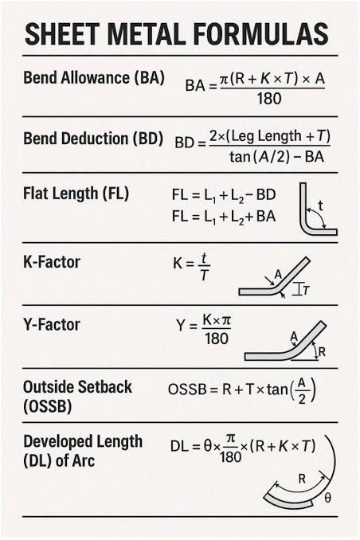

# Sheet Metal Forming & Bending Reference Guide
 

Here is a comprehensive breakdown of the sheet metal working formulas provided in **image-1.png**, along with pseudocode and their direct integration into the **Machinist.like.audio** interactive press brake suite ([SheetMetalBending.tsx](file:///home/anthony/Documents/GitProjects/Machinist.like.audio/src/components/SheetMetalBending/SheetMetalBending.tsx)). 

Before diving into the formulas, let's establish the standard industrial variables used across these calculations:
*   **$R$** = Inside Bend Radius
*   **$T$** = Material Thickness
*   **$K$** = K-Factor (Neutral axis displacement ratio)
*   **$A$** or **$\theta$** = Bend Angle (in degrees)
*   **$t$** = Distance from the inside face to the neutral axis ($t = K \times T$)
*   **$L_1, L_2$** = Flange / Leg lengths
*   **$\text{OSSB}$** = Outside Setback

---

### 1. Bend Allowance (BA)
Bend allowance is the arc length of the bend measured along the neutral axis of the material. It tells you exactly how much material is required to form the curved section of the bend without stretching or compressing.

**Formula:**
$$BA = \frac{\pi \cdot (R + K \cdot T) \cdot A}{180}$$

**Pseudocode:**
```text
FUNCTION calculate_BA(radius, k_factor, thickness, angle):
    CONSTANT PI = 3.141592653589793
    neutral_axis_radius = radius + (k_factor * thickness)
    RETURN (PI * neutral_axis_radius * angle) / 180
```

---

### 2. Bend Deduction (BD)
Bend deduction is the amount of material that must be subtracted from the total outside dimensions of your flanges to get the correct flat pattern length. It accounts for material stretching and thinning during the plastic deformation of bending.

**Formula:**
$$BD = 2 \cdot (R + T) \cdot \tan\left(\frac{A}{2}\right) - BA = 2 \cdot \text{OSSB} - BA$$

**Pseudocode:**
```text
FUNCTION calculate_BD(radius, thickness, angle, bend_allowance):
    // Note: Standard trig functions in programming languages require radians
    angle_rad = convert_degrees_to_radians(angle)
    outside_setback = (radius + thickness) * TAN(angle_rad / 2)
    RETURN (2 * outside_setback) - bend_allowance
```

---

### 3. Flat Pattern Length (FL)
Flat length is the total length of the raw sheet metal blank required before any bending occurs. The approach depends on how your leg lengths ($L_1$ and $L_2$) are dimensioned on the engineering drawing.

**Formulas:**
*   If $L_1$ and $L_2$ are **outside dimensions** (measured to the apex of the sharp outside corner): 
    $$FL = L_1 + L_2 - BD$$
*   If $L_1$ and $L_2$ are **straight leg dimensions** (measured only up to the tangent point where the bend arc starts): 
    $$FL = L_1 + L_2 + BA$$

**Pseudocode:**
```text
FUNCTION calculate_FL_from_outside_dims(L1, L2, bend_deduction):
    RETURN L1 + L2 - bend_deduction

FUNCTION calculate_FL_from_straight_legs(L1, L2, bend_allowance):
    RETURN L1 + L2 + bend_allowance
```

---

### 4. K-Factor ($K$)
The K-Factor is a dimensionless ratio representing the location of the neutral axis with respect to material thickness. The neutral axis is the internal boundary layer inside the sheet metal that neither stretches in tension nor compresses in compression during bending. For most standard air bending in steel and aluminum, $K \approx 0.33 \text{ to } 0.50$.

**Formula:**
$$K = \frac{t}{T}$$

**Pseudocode:**
```text
FUNCTION calculate_k_factor(neutral_axis_distance, thickness):
    RETURN neutral_axis_distance / thickness
```

---

### 5. Y-Factor ($Y$)
The Y-Factor is a mathematical variation of the K-Factor utilized by specialized CAD software systems (such as PTC Creo and Pro/ENGINEER) to compute developed lengths. It converts the K-Factor into a $\pi$-weighted radian modifier where $BA = (R + Y \cdot T) \cdot A$.

**Formula:**
$$Y = \frac{K \cdot \pi}{180} \approx K \cdot 0.0174533$$

**Pseudocode:**
```text
FUNCTION calculate_y_factor(k_factor):
    CONSTANT PI = 3.141592653589793
    RETURN (k_factor * PI) / 180
```

---

### 6. Outside Setback (OSSB)
The Outside Setback is the distance from the bend tangent point (where the straight flange transitions into the curved radius) to the apex of the outside corner formed by the intersection of the two flange planes.

**Formula:**
$$\text{OSSB} = (R + T) \cdot \tan\left(\frac{A}{2}\right)$$

**Pseudocode:**
```text
FUNCTION calculate_OSSB(radius, thickness, angle):
    angle_rad = convert_degrees_to_radians(angle)
    RETURN (radius + thickness) * TAN(angle_rad / 2)
```

---

### 7. Developed Length (DL) of Arc
This formula computes the flattened arc length of any arbitrary curved sheet metal section or roll-bent profile. Conceptually identical to Bend Allowance, it uses the subtended arc angle $\theta$ for the specific curved segment.

**Formula:**
$$DL = \theta \cdot \frac{\pi}{180} \cdot (R + K \cdot T)$$

**Pseudocode:**
```text
FUNCTION calculate_DL(arc_angle, k_factor, radius, thickness):
    CONSTANT PI = 3.141592653589793
    neutral_axis_radius = radius + (k_factor * thickness)
    RETURN arc_angle * (PI / 180) * neutral_axis_radius
```

---

### 8. Industrial Sheet Metal Materials & Characteristics
The following reference table synthesizes the industrial sheet metal properties, applications, and material characteristics from **image-2.png**:

| Sheet Metal Name | Characteristics & Mechanical Properties | Typical Applications |
| :--- | :--- | :--- |
| **Aluminum** | Cold-rolled non-ferrous material ($0.2\text{ mm} \le T \le 6.0\text{ mm}$). Silver-colored, low-density metal with high ductility and moderate strength. Exhibits outstanding atmospheric corrosion resistance.<br><br>Can be dramatically strengthened via alloying elements (Cu, Mg, Mn, Si, Zn) and heat/work treatments (e.g., 6061-T6, 5052-H32). | Aerospace structures, automotive body panels, marine hardware, electronic enclosures, and lightweight transportation equipment. |
| **Brass** | Non-ferrous copper-zinc alloy. Features low friction coefficients, excellent acoustic resonance, high electrical/thermal conductivity, and resistance to galvanic corrosion. | Decorative architectural trim, condenser and heat exchanger tubing, plumbing fittings, musical instruments, and precision gears/fasteners. |
| **Cold Rolled Steel (CRS)** | Ferrous carbon steel processed at ambient temperatures below recrystallization ($<700^\circ\text{C}$). Cold reduction increases tensile strength and hardness while decreasing ductility.<br><br>Provides superior dimensional tolerances, sharp corners, and a smooth, scale-free surface finish compared to hot rolled steel. | Precision metal brackets, cabinetry, metal furniture, home appliances, automotive components, and stamped consumer goods. |
| **Copper** | Non-ferrous pure copper or lightly alloyed copper. Exhibits exceptionally high thermal and electrical conductivity, excellent ductility for deep drawing, and superior resistance to biometallic corrosion. | Electrical busbars, architectural roofing/gutters, radiator cores, plumbing pipes, heat sinks, and coinage. |
| **Expanded Sheet Metal** | Ferrous or non-ferrous sheet metal manufactured by shearing slits into a regular sheet and stretching it laterally to form a rigid diamond pattern.<br><br>Lighter, stronger per unit weight, and more economical than solid sheet metal while permitting free passage of light, air, liquids, and acoustic waves. | Safety guards, walkways, machine grates, architectural screening, fencing, and speaker grilles. |
| **Galvanized Steel** | Ferrous steel coated with a sacrificial protective zinc layer via hot-dip galvanizing around $460^\circ\text{C}$ ($860^\circ\text{F}$). Atmospheric exposure forms zinc carbonate, a robust, dull grey patina that prevents substrate rust, identifiable by crystalline *spangles*.<br><br>⚠️ **CRITICAL WELDING WARNING:** *Welding or torch-cutting galvanized steel vaporizes the zinc coating, producing toxic zinc oxide fumes that cause metal fume fever. Proper respiratory protection and local fume extraction are mandatory.* | Outdoor structural framing, HVAC ductwork, roofing sheets, agricultural equipment, and marine/coastal infrastructure. |
| **Hot Rolled Steel (HRS)** | Ferrous steel rolled from billets at temperatures above recrystallization ($>926^\circ\text{C}$ / $1700^\circ\text{F}$). The metal can be formed easily without work hardening.<br><br>Identifiable by its characteristic blue-grey mill scale (iron oxide) surface coating and slightly rounded corners/loose tolerances. | Heavy structural beams, frame rails, welding plates, construction machinery, and industrial piping where surface finish is secondary. |
| **Stainless Steel** | Ferrous alloy steel formulated for exceptional corrosion and oxidation resistance. Must contain a minimum of $10.5\%$ to $11.0\%$ Chromium (Cr), often alloyed with Nickel (Ni) and Molybdenum (Mo) (e.g., 304, 316, 430 series). | Food processing equipment, medical/surgical instruments, chemical tanks, architectural cladding, and marine hardware. |

---

### System Integration Note
All 7 bending algorithms detailed above ($BA$, $BD$, $FL$, $K$-Factor, $Y$-Factor, $\text{OSSB}$, and $DL$) are programmatically implemented in real time within the **Machinist Hub** under Category 6 (**Sheet Metal Forming & Bending**). You can test these mathematical models interactively using the **Sheet Metal Bending Simulator** tool in the web application.